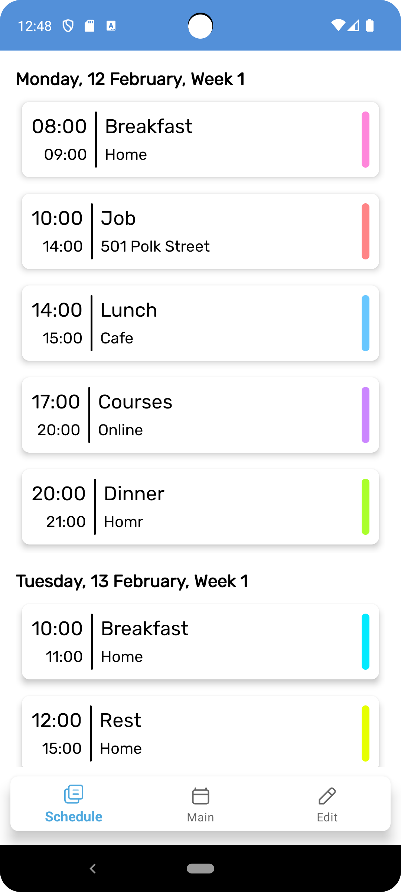
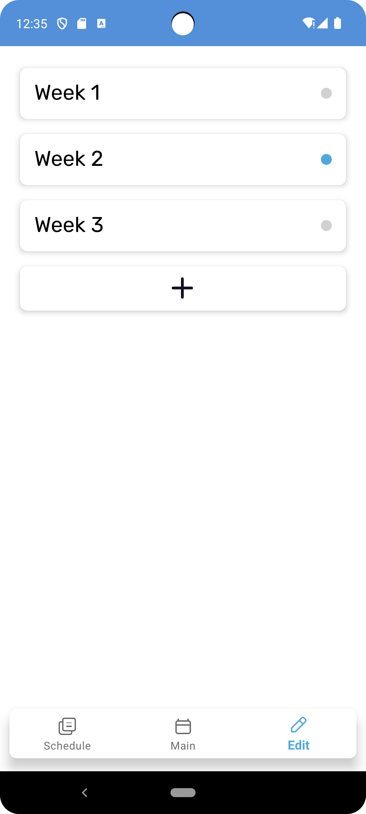
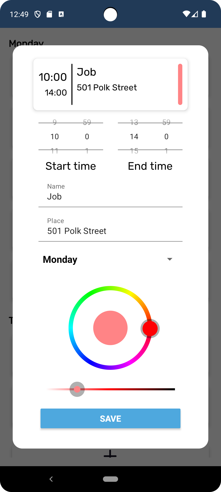
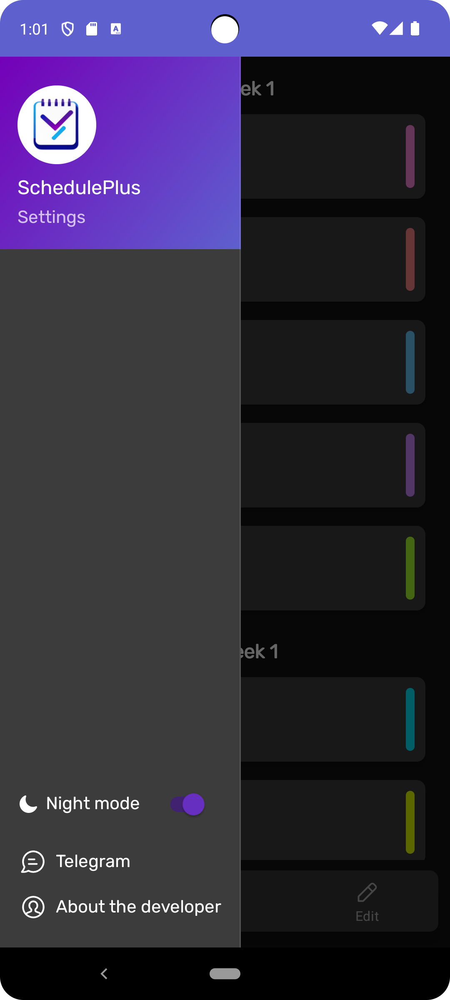

# SchedulePlus

Applications for creating a convenient schedule with a wide range of editing options.

## Screenshots

  

## Description

SchedulePlus is an intuitive and convenient application for managing time and creating a personal schedule. Whether you are a student, a professional, or a caring parent, SchedulePlus will help you efficiently plan your day.

**Creating a flexible schedule:**
- Easily add and customize tasks, events, and meetings.
- Choose the week, start time, and end time for each event.
- Personalize your schedule with various color labels for different types of events.
- Swipe right to open the settings panel and select between light and dark themes to make the app more eye-friendly.
- Long press on a week to make it active. Your schedule will become current.

SchedulePlus is designed to assist you in organizing your life, reducing stress, and enhancing the efficiency of your time. Start creating your perfect schedule right now!

## Installation

Download SchedulePlus.apk and install on your phone
